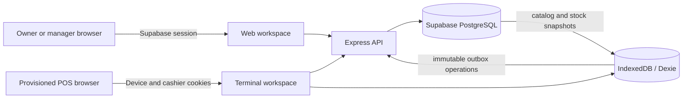

# Counterline POS

Counterline is an offline-capable point-of-sale system for independent retailers. It has two connected experiences:

- an owner/manager workspace for store setup, catalog management, reports, inventory, employees, terminals, orders, returns, and exchanges;
- a provisioned terminal workspace for cashiers and PIN-based managers to sell even when the network is unavailable.

The browser records a completed sale locally first, preserves its receipt and stock effect, and synchronizes the same immutable operation to PostgreSQL when connectivity is available. Money is stored and calculated in integer cents.

## Current status

The current product scope is implemented and tested across the web client, API, database migrations, and browser workflows.

| Area | Current behavior |
|---|---|
| Accounts and stores | Email/password owner access, invitations, store membership, onboarding, and store profile settings |
| Terminals and staff | Browser provisioning, employee PINs, cashier/manager roles, revocation, online refresh, and bounded offline authorization |
| Catalog | Categories, tax rates, ordinary products, photos, product variants, SKU/barcode lookup, and independent variant stock |
| Checkout | Cash and manually confirmed external-card sales, line discounts, manager approval, integer-cent totals, receipts, and reprints |
| Offline operation | Local catalog, customer and sale persistence, outbox retries, idempotent server writes, provisional stock, and a sync center |
| Customers | Name/phone creation and search, including offline creation before a dependent sale |
| Orders and reports | Local receipt history, sync state, daily totals, cashier/product breakdowns, refunds, and oversold visibility |
| Inventory | Stock status, per-product thresholds, manual adjustments, movement history with actor attribution, and cycle counts |
| Returns and exchanges | Partial/full returns, restock choice, manual external-card refund confirmation, and linked replacement sales |

This is suitable for controlled pilot evaluation. Production rollout still requires testing with the exact shop hardware and deployment environment, a backup/recovery runbook, monitoring, and an explicit decision about the risk of losing unsynchronized browser storage. Integrated payment-terminal processing, automatic bank refunds, wallets, loyalty, and store credit are outside the current scope.

## Repository layout

```text
apps/web/                 React + Vite PWA and IndexedDB/Dexie client
apps/api/                 Express API and PostgreSQL transactions
packages/domain/          Shared deterministic money and domain rules
supabase/migrations/      Ordered PostgreSQL/Supabase schema migrations
api/openapi.yaml          API contract
docs/                     Architecture, requirements, feature runbooks, and evidence
QA_REPORT.md              Historical QA findings and remediation notes
SETUP.md                  Original team/bootstrap notes
```

## How the system works



The owner workspace uses a Supabase user session and active store membership. The terminal workspace uses a separately provisioned device session plus an employee PIN session. Terminal employees are intentionally separate from email accounts.

A sale is committed locally in one Dexie transaction. The order, line snapshots, payment, receipt sequence, stock overlay, audit data, and outbox operation either all commit or none do. The API processes the operation in one PostgreSQL transaction and stores its operation ID, so a lost response or retry cannot create a second sale or duplicate stock movement.

The displayed terminal stock is the latest downloaded server stock plus local unsynchronized adjustments. A paid sale remains visible if synchronization fails; the application does not silently delete or rewrite it.

## Roles

| Role | Main access |
|---|---|
| Owner | Full store management, reports, staff, terminals, catalog, inventory, returns, and exchanges |
| Manager | Operational management, catalog/inventory access, reports, returns/exchanges, and terminal approvals; manager creation remains owner-controlled |
| Cashier | Terminal selling, customers, receipts, and ordinary order history; management actions require an owner/manager or manager PIN approval |

Returns, exchanges, stock adjustments, and other privileged terminal actions require an online server response. Offline checkout remains available only within the cached authorization policy.

## Day-to-day product flow

### 1. Create and configure a store

1. Open `/signup` and create the owner account.
2. Complete `/onboarding`: store details, terminal setup, and initial staff.
3. In **Settings**, review store details, employees, terminals, activity, receipt hardware, and local storage readiness.
4. In **Products**, create categories, tax rates, ordinary products, or variant parents and variants.

New variants begin as drafts. A published variant can later be edited or deactivated, but it cannot be reset to a deletable draft because an offline terminal may already have sold it.

### 2. Provision a terminal and unlock it

1. Sign in as an owner or manager.
2. Open `/settings/employees` and create an active cashier or manager with a 4–8 digit PIN.
3. Open `/settings/terminals` and provision the current browser.
4. Open `/pos/login`, select the employee, and enter the PIN.
5. While online, open the register once so the store catalog and stock are available locally.

An online terminal refreshes permissions from the server. Cached offline PIN access expires seven days after server validation; manager approvals expire after 72 hours. Five incorrect attempts cause a 60-second lockout.

### 3. Complete a sale

1. Open **Sell**.
2. Search by name/SKU or scan a barcode as keyboard input followed by Enter.
3. Select a variant when a product has options, adjust quantity, optionally attach a customer, and add permitted line discounts.
4. Continue to payment.
5. For cash, enter the amount received. For card, process payment on the independent card terminal, optionally record its reference, and explicitly confirm approval in Counterline.
6. Complete the sale and print or reprint the saved receipt.

Counterline records external-card confirmation; it does not contact a bank or card terminal. A printing failure does not roll back an already recorded sale.

### 4. Work offline and synchronize

After provisioning and an online catalog load, a cashier can unlock and complete sales within the offline authorization window. Local receipts and order history remain available in the same browser.

When connectivity returns, the terminal retries pending operations. Customer creation is synchronized before any sale that references that customer. Use **Sync Center** to distinguish pending, in-flight, retryable, blocked, rejected, and synchronized records. Never clear browser storage as a routine sync fix: unsynchronized sales exist only in that browser.

### 5. Manage inventory

The inventory page derives status from current stock and the product's threshold:

- stock greater than the threshold: **Normal**;
- stock from 1 through the threshold: **Low**;
- stock equal to 0: **Out**;
- stock below 0: **Oversold**.

The threshold is an alert/filter setting. It does not change stock, block sales, or create a purchase order.

Owners and managers can create a manual adjustment with a required reason and note. Every adjustment creates one immutable inventory movement. **All movements** and each product's **History** show product, reason, delta, old/new stock, note, actor, and time. Rows without historical actor evidence display **System**.

A cycle count snapshots expected quantities for counting, but submission compares the entered counts with live locked stock. Only actual variances create movements. Cycle counts require the owner/manager web session; terminal managers can view inventory and approve manual adjustments.

### 6. Return or exchange a sale

1. Open **Orders** and select the original receipt.
2. Choose **Return** or **Exchange**. Only owners/managers, including an online PIN-approved terminal manager, can continue.
3. Select quantities. The screen shows already returned quantities and prevents returning more than was sold.
4. Choose a reason. `Other` requires a note.
5. Decide which returned quantities are sellable and should be restocked. Damaged/unsellable goods can be returned without increasing stock.
6. Confirm the payment outcome. Cash and manually confirmed external-card outcomes are recorded in integer cents; an optional external reference can be saved.

An exchange records the return and creates a separate linked replacement sale. The original order, payment, receipt, and line items stay immutable. The replacement can be equal value, require more payment from the customer, or leave an amount owed to the customer.

Returns and exchanges are online-only. Retried requests use stable operation IDs so they do not duplicate refunds or stock movements.

## Local development

### Prerequisites

- Node.js 22 or newer (the project is regularly exercised on Node 24)
- npm
- a Supabase project with email/password authentication enabled
- a PostgreSQL connection string for that Supabase project
- the Supabase production CA certificate when using its pooler
- Playwright Chromium only when running browser acceptance checks

### Configure the API

```powershell
cd apps/api
Copy-Item .env.example .env
npm ci
```

Fill `apps/api/.env`:

```dotenv
DATABASE_URL=postgresql://...
SUPABASE_DB_CA_CERT_PATH=certs/supabase-prod-ca-2021.crt
WEB_ORIGIN=http://127.0.0.1:5173
SUPABASE_URL=https://YOUR_PROJECT.supabase.co
SUPABASE_PUBLISHABLE_KEY=YOUR_PUBLISHABLE_KEY
PORT=3001
NODE_ENV=development
```

Keep `DATABASE_URL` and database credentials server-side. Do not put them in the Vite environment.

### Configure the web application

```powershell
cd apps/web
Copy-Item .env.example .env.local
npm ci
```

Fill `apps/web/.env.local`:

```dotenv
VITE_SUPABASE_URL=https://YOUR_PROJECT.supabase.co
VITE_SUPABASE_PUBLISHABLE_KEY=YOUR_PUBLISHABLE_KEY
VITE_API_URL=/api
```

Vite proxies `/api` to the local API and removes the prefix. Browser requests therefore remain same-origin during development.

### Apply database migrations

Apply every `.sql` file in `supabase/migrations` in filename order using the Supabase SQL editor or your controlled PostgreSQL migration process. Do not edit a migration after it has been applied.

`202609180006_stores_country_column.sql` is a repair migration for environments that missed the earlier store-business-details change. Inspect the target schema before replaying historical migrations. The current schema ends with:

```text
202609220001_inventory_operations.sql
202609220002_product_variants.sql
202609230001_partial_refunds.sql
202609240001_terminal_manager_refund_approval.sql
```

The API must not be deployed before its matching migrations. A missing migration normally appears as a PostgreSQL `column does not exist` error in the API log.

### Start locally

Terminal 1:

```powershell
cd apps/api
npm run dev
```

Terminal 2:

```powershell
cd apps/web
npm run dev -- --host 127.0.0.1
```

Open:

- web application: `http://127.0.0.1:5173`
- API health check: `http://127.0.0.1:3001/health`

If the frontend reports that the API could not complete a request, first check the API terminal. Confirm `/health`, the PostgreSQL connection, and that the latest migration is applied.

## Tests

Web unit/integration tests and production build:

```powershell
cd apps/web
npm test
npm run build
```

API type/build and test suites:

```powershell
cd apps/api
npm run build
npm test
npm run test:orders
npm run test:integration
```

The API repository also contains focused Playwright runners under `apps/api/test/*-browser-check.ts` for terminal authentication, catalog, customers, reports, refunds, exchanges, inventory, manager approval, currency changes, and variants. Install Chromium once if required:

```powershell
cd apps/api
npx playwright install chromium
```

Run a focused browser check with, for example:

```powershell
node --import tsx test/exchange-browser-check.ts
```

Some browser runners build the web app with fixture configuration. Run the normal web build afterward before packaging or previewing the application.

## Data and security rules

- Store-scoped foreign keys and authorization checks prevent cross-store references.
- Browser roles cannot write service-only order, payment, movement, operation-ledger, or terminal-session tables directly.
- The API validates current owner/manager membership for privileged web operations.
- Terminal sessions are revocable and tied to one store and device.
- Completed orders and receipts are immutable. Returns and exchanges create linked records.
- Product names, SKUs, prices, taxes, discounts, and variant options are snapshotted on order lines.
- Monetary values use integer cents; tax and percentage discount calculations use deterministic rounding.
- Operation IDs and database constraints protect retries from duplicate business effects.
- Never commit `.env`, passwords, database URLs, Supabase secret/service keys, terminal cookies, or real PINs.


## Further documentation

- [Technical stack](docs/01_tech_stack.md)
- [Architecture](docs/02_architecture.md)
- [Offline and sync contract](docs/03_sync_architecture.md)
- [Data model diagrams](docs/04_er_diagrams.md)
- [Product requirements](docs/05_product_requirements.md)
- [Integration and verification](docs/06_integration_and_flows.md)
- [Catalog/checkout/sync runbook](docs/08_catalog_checkout_sync_runbook.md)
- [Terminal access](docs/terminal-access/README.md)
- [Terminal hardware](docs/terminal-hardware/README.md)
- [Receipts](docs/receipts/README.md)
- [Product variants](docs/product-variants/README.md)
- [Inventory plan](docs/phase-2-inventory-operations-plan.md)
